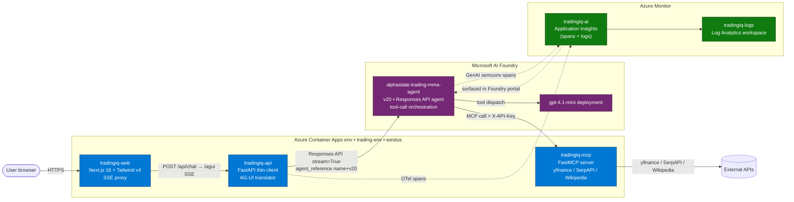
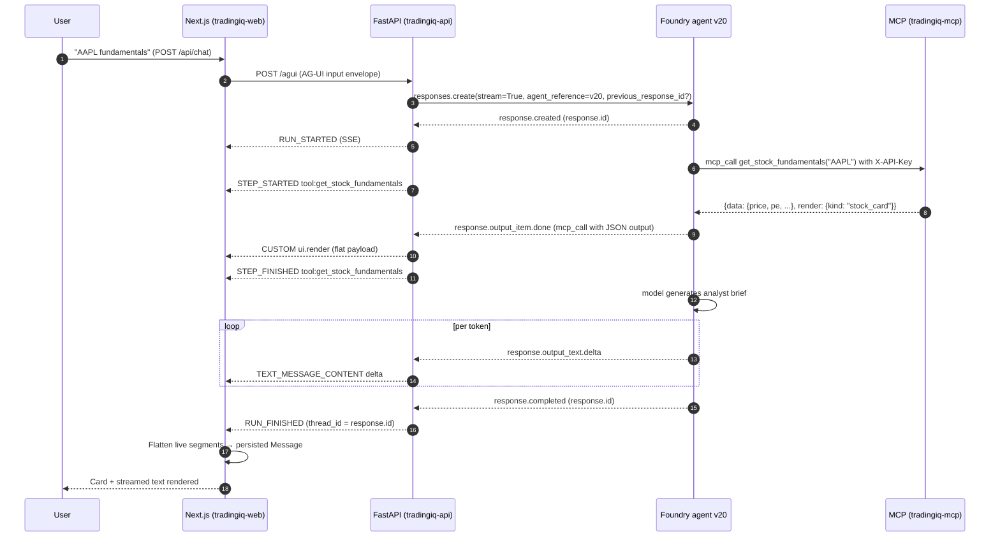

# Trading IQ — Institutional Equity Research @ Your Voice Command

A multi-agent equity-research assistant. Type or speak a question about a stock
("AAPL fundamentals", "52-week chart of NVDA", "MSFT vs GOOGL") and the system
calls real market-data tools, generates a structured analyst brief, and renders
inline cards (price + range bar, P/E + market cap, an interactive chart) while
the LLM streams its response token by token.

The brain is **Microsoft AI Foundry**. Foundry orchestrates the LLM call,
decides which MCP tool to invoke, and returns structured tool outputs and a
streaming narrative. A thin FastAPI client wraps the Foundry Responses API and
converts its stream into the [AG-UI protocol](https://docs.ag-ui.com) for the
Next.js frontend.

Live: **https://tradingiq-web.proudisland-e27da000.westus.azurecontainerapps.io**

---

## Table of Contents

- [What this is](#what-this-is)
- [High-level architecture](#high-level-architecture)
- [Runtime sequence](#runtime-sequence)
- [Microsoft AI Foundry — the brain](#microsoft-ai-foundry--the-brain)
- [Azure resources](#azure-resources)
- [Identity, RBAC, and auth surfaces](#identity-rbac-and-auth-surfaces)
- [Observability — OpenTelemetry → Azure Monitor → Foundry portal](#observability--opentelemetry--azure-monitor--foundry-portal)
- [Repository layout](#repository-layout)
- [Local development](#local-development)
- [Deployment](#deployment)
- [Roadmap](#roadmap)
- [Related repositories](#related-repositories)

---

## What this is

This repo ships three deployable services that together form a streaming,
agent-driven equity-research UI:

| Service | What it does |
|---|---|
| **MCP server** ([mcp-server/](mcp-server/)) | Five tools backed by yfinance, SerpAPI and Wikipedia. Each renderable tool returns a self-describing `{data, render}` envelope so the frontend can render a typed card. Exposed over HTTP with `FastMCP` and gated by an `X-API-Key`. |
| **FastAPI client** ([tradingiq/](tradingiq/)) | Thin client over the Foundry Responses API. Streams Foundry events and translates them into AG-UI SSE events (`STEP_STARTED`, `TEXT_MESSAGE_CONTENT`, `CUSTOM ui.render`, `RUN_FINISHED`). Wired to OpenTelemetry → App Insights → Foundry's Tracing tab. |
| **Next.js frontend** ([tradingiq/frontend/](tradingiq/frontend/)) | React + Tailwind chat UI. Parses AG-UI events on the wire, renders step pills + cards + token-streamed text in arrival order, then flattens the live segments into a persisted message on `RUN_FINISHED`. |

The system is **not** a traditional RAG application; it is a **tool-calling
agent loop**. Foundry hosts the agent, picks tools, and produces the text. The
MCP server provides the tools. The frontend is purely a renderer.

---

## High-level architecture



Three things worth calling out in this diagram:

1. **Foundry calls the MCP server directly**, not via FastAPI. FastAPI starts
   the agent run and consumes the stream, but tool invocations happen inside
   Foundry's runtime. That is why the MCP server has its own ingress and
   `X-API-Key` — the request originates from Microsoft's network, not from our
   API container.
2. **Tracing has two paths into the same App Insights resource**: Foundry
   emits its own GenAI-semconv spans (model name, prompt, usage tokens), and
   our FastAPI emits the surrounding `agent.run` span via
   `AIProjectInstrumentor`. The Foundry portal then correlates them because
   both carry `microsoft.foundry.project.id`.
3. **The frontend never talks to Foundry directly.** Browser → Next.js route
   handler → FastAPI is a CORS-clean SSE pipe; user identity (when it exists)
   would be validated at the API layer, never on the frontend.

---

## Runtime sequence

A single chat turn:



Two streaming invariants that the AG-UI client validates:

- Text frames must be `TEXT_MESSAGE_START` → many `TEXT_MESSAGE_CONTENT` deltas
  → `TEXT_MESSAGE_END`. Never mix `TEXT_MESSAGE_CHUNK` in a flow that already
  uses explicit start/end — the validator rejects it as "already in progress".
- Tool windows must be `STEP_STARTED` → optional `CUSTOM ui.render` → `STEP_FINISHED`,
  in that order. Render events outside a step window are accepted but render
  immediately rather than in flow.

---

## Microsoft AI Foundry — the brain

The agent itself does not live in this repo. It lives in **Microsoft AI Foundry**,
in a project called `alpha-state-trading-MMA` under the Foundry resource
`alpha-state-trading-multi-agent` (westus).

### Foundry components in use

| Component | Value | Purpose |
|---|---|---|
| **Foundry resource** | `alpha-state-trading-multi-agent` | Cognitive Services account holding the project |
| **Project** | `alpha-state-trading-MMA` | RBAC scope; receives traces; lists connected resources |
| **Endpoint** | `https://alpha-state-trading-multi-agent.services.ai.azure.com/api/projects/alpha-state-trading-MMA` | Used by `AIProjectClient` |
| **Agent** | `alphastate-trading-mma-agent`, version **v20** | The runtime; orchestrates model + tools |
| **Model deployment** | `gpt-4.1-mini-2025-04-14` | Backing LLM (selected inside the agent's config) |
| **MCP tools** | 5 tools, attached directly to the agent | Source-of-truth data |
| **Connected resource** | `tradingiq-ai` (App Insights) | Foundry portal's Tracing tab reads from here |

### How we call Foundry

Foundry exposes its agent over the **OpenAI Responses API**. Even though the
underlying agent type is Foundry-v2 (not legacy Assistants), the wire protocol
is the standard OpenAI Responses format, accessed via:

```python
from azure.ai.projects import AIProjectClient
from azure.identity import DefaultAzureCredential

project = AIProjectClient(endpoint=..., credential=DefaultAzureCredential())
openai_client = project.get_openai_client()

stream = openai_client.responses.create(
    input=[{"role": "user", "content": query}],
    extra_body={
        "agent_reference": {
            "name": "alphastate-trading-mma-agent",
            "version": "20",
            "type": "agent_reference",
        }
    },
    previous_response_id=thread_id if thread_id.startswith("resp_") else None,
    stream=True,
)
```

The agent's system prompt, tool list, MCP server URL, and model are all
configured **in the Foundry portal**, not in code. Every time we change those,
the agent's version number bumps and we pin the new version via
`AZURE_EXISTING_AGENT_VERSION` on `tradingiq-api`. That is why this repo has
agent v17 → v18 → v19 → v20 markers in the Git Tags timeline.

### MCP tools attached to the agent

| Tool | Returns | Backed by |
|---|---|---|
| `get_stock_fundamentals(ticker)` | Stock card envelope (price, P/E, market cap tier, 52w range, ROE, dividend yield) | yfinance |
| `get_price_history(ticker, period)` | Chart envelope (daily close series + stats) | yfinance |
| `get_yahoo_finance_news(ticker)` | News headlines (plain text) | yfinance |
| `search_news(query)` | Last-24h Google News (plain text) | SerpAPI |
| `wikipedia_lookup(query)` | Article summary (plain text) | wikipedia-api |

The two renderable tools (`get_stock_fundamentals`, `get_price_history`) return
a self-describing **`{data, render: {kind}}`** envelope. The FastAPI client
detects the envelope generically and forwards a `CUSTOM ui.render` event to the
frontend; **no per-tool plumbing in FastAPI**. To add a new inline UI element,
add the MCP tool and a frontend variant — the backend does not need to change.

Each renderable tool's docstring carries a **DIVISION OF LABOR** clause telling
the agent: "the card already shows ticker, price, P/E, market cap — do not
restate those numbers; write interpretation the card can't express." Without
this the LLM duplicates information that is already on screen.

### Streaming event mapping

The Foundry Responses stream → AG-UI translation lives in
[tradingiq/app/agent.py](tradingiq/app/agent.py):

| Foundry event | AG-UI event |
|---|---|
| `response.created` | (capture response.id) |
| `response.output_item.added` (mcp_call) | `STEP_STARTED` with `step_name="tool:<name>"` |
| `response.output_item.done` (mcp_call) | `CUSTOM ui.render` (if `{data, render}` envelope) + `STEP_FINISHED` |
| `response.output_item.added` (message) | (next text delta will open a new TEXT_MESSAGE_START) |
| `response.output_text.delta` | `TEXT_MESSAGE_START` (once) + `TEXT_MESSAGE_CONTENT` (one per delta) |
| `response.output_item.done` (message) | `TEXT_MESSAGE_END` |
| `response.completed` | `RUN_FINISHED` with `thread_id = response.id` |
| `mcp_approval_request` (item type) | Surfaced as a clear user-visible error; `thread_id` reset to prevent conversation poisoning |

---

## Azure resources

All resources live in subscription `9b0c035b-cf37-487c-8eab-505bcad22ea8`,
resource group `rg-dev`, region `westus`.

### Container Apps

| App | Image | Ingress | Notes |
|---|---|---|---|
| `tradingiq-web` | `alphastatetradingacr.azurecr.io/tradingiq-web:v2` | External, port 3000 | Next.js 16 in standalone mode |
| `tradingiq-api` | `alphastatetradingacr.azurecr.io/tradingiq-api:v3` | External, port 8000 | FastAPI + OTel; CORS for tradingiq-web only |
| `tradingiq-mcp` | `alphastatetradingacr.azurecr.io/tradingiq-mcp:v2` | External, port 8080 | External by necessity — Foundry's MCP client cannot reach internal-only endpoints today |

All three share the Container Apps Environment `trading-env`. The shared
environment means the apps can resolve each other's FQDNs without extra
networking config.

### Other Azure resources

| Resource | Type | Purpose |
|---|---|---|
| `alphastatetradingacr` | Container Registry | Holds all three images. Image pulls authenticate via Container App MIs. |
| `tradingiq-logs` | Log Analytics workspace | Backing store for App Insights |
| `tradingiq-ai` | Application Insights (workspace-based) | Trace and log destination; **attached to the Foundry project** so Foundry's Tracing tab reads from it |
| `alpha-state-trading-multi-agent` | AI Foundry resource (Cognitive Services account) | Hosts the project |
| User-assigned MIs | × 3 (one per Container App) | See [Identity, RBAC, and auth surfaces](#identity-rbac-and-auth-surfaces) below |

### Build + deploy

ACR build (cloud-side, no Docker required locally):

```sh
# Backend
az acr build --registry alphastatetradingacr --image tradingiq-api:vN \
  --platform linux/amd64 tradingiq/

# Frontend
az acr build --registry alphastatetradingacr --image tradingiq-web:vN \
  --platform linux/amd64 tradingiq/frontend/

# MCP server
az acr build --registry alphastatetradingacr --image tradingiq-mcp:vN \
  --platform linux/amd64 mcp-server/
```

Rollout:

```sh
az containerapp update -n tradingiq-api -g rg-dev \
  --image alphastatetradingacr.azurecr.io/tradingiq-api:vN
```

Shortcuts via Claude Code: `/deploy-api`, `/deploy-web`, `/tail-logs`.

---

## Identity, RBAC, and auth surfaces

The system has **four distinct trust boundaries**, each with its own auth
mechanism. Understanding them is the most important security context for this
repo.

### Boundary 1: Browser ↔ Next.js frontend

- **Status:** Open (no auth).
- Anyone with the URL can use the app.
- Threads are stored in browser `localStorage` keyed by random UUID — no user
  identity exists today.
- See [Roadmap](#roadmap) for Entra ID work.

### Boundary 2: Next.js ↔ FastAPI

- **Status:** CORS-restricted, no auth token.
- `CORS_ALLOWED_ORIGINS=https://tradingiq-web.proudisland-e27da000.westus.azurecontainerapps.io,http://localhost:3000`
  on `tradingiq-api`. Any other origin is rejected at the API layer.
- The Next.js route handler `/api/chat` proxies SSE to the FastAPI `/agui`
  endpoint. The browser never calls the API directly.

### Boundary 3: FastAPI ↔ Foundry

- **Status:** Managed identity, RBAC.
- `tradingiq-api` runs with the user-assigned MI `tradingiq-api-mi`.
- That MI has the **`Azure AI User`** role on the project scope.
- `DefaultAzureCredential` (Python) picks up the MI automatically inside the
  container; locally it falls back to `az login`.
- Today, every user's request is made to Foundry under the **same** MI
  identity, so Foundry's audit log shows one identity. Per-user identity
  (On-Behalf-Of) is on the roadmap; it would require Boundary 1 first.

### Boundary 4: Foundry ↔ MCP server

- **Status:** Shared-secret header.
- Foundry sends every MCP request to `https://tradingiq-mcp.proudisland-….../mcp`
  with header `X-API-Key: <mcp-api-key>`.
- The key is stored as a Container App secret on `tradingiq-mcp`. Foundry
  carries the same value in its agent configuration.
- `FastMCP`'s middleware in [mcp-server/server.py](mcp-server/server.py)
  rejects any request to `/mcp/*` whose header value does not match, with
  HTTP 401.
- **Key rotation** is a two-step process: rotate the Container App secret,
  then save a new agent version in the Foundry portal with the updated
  header value, then bump `AZURE_EXISTING_AGENT_VERSION` on `tradingiq-api`.
  There is a brief downtime window between the rotation and the agent
  version pin (the agent on the old version sends the old key and gets 401s).

### Managed identities and their roles

| Managed identity | Type | RBAC grants |
|---|---|---|
| `tradingiq-mcp-mi` | User-assigned | `AcrPull` on the registry |
| `tradingiq-api-mi` | User-assigned | `AcrPull` on registry · `Azure AI User` on Foundry project · `Monitoring Metrics Publisher` on `tradingiq-ai` |
| `tradingiq-web-mi` | User-assigned | `AcrPull` on the registry |

User-assigned (not system-assigned) is deliberate: we provision the MI first,
grant `AcrPull`, **then** create the Container App. With system-assigned, the
MI does not exist until the app is created, which means the very first revision
cannot pull its own image.

---

## Observability — OpenTelemetry → Azure Monitor → Foundry portal

Tracing is wired through **Azure AI Foundry's** built-in observability stack.
Foundry's Tracing tab is not a separate ingestion endpoint — it reads spans out
of whatever Application Insights resource is attached to the project. We
attached `tradingiq-ai` in the Foundry portal under *Connected resources*.

### Bootstrap

[tradingiq/app/tracing.py](tradingiq/app/tracing.py) on app startup:

```python
project = AIProjectClient(endpoint=..., credential=DefaultAzureCredential())
connection_string = project.telemetry.get_application_insights_connection_string()
configure_azure_monitor(connection_string=connection_string)  # one call
AIProjectInstrumentor().instrument()                          # patches Responses API
```

That one block installs:

- A `TracerProvider` with a `BatchSpanProcessor`
- The Application Insights span exporter
- Auto-instrumentation for FastAPI, httpx, requests, urllib3, logging
- The Foundry GenAI auto-instrumentor (every `responses.create()` call
  produces a span with the standard `gen_ai.*` semantic-convention attributes)

If the project has no App Insights attached, the bootstrap logs a warning and
falls back to a no-op tracer — the app still boots.

### Required environment variables

| Var | Value | Why |
|---|---|---|
| `AZURE_EXPERIMENTAL_ENABLE_GENAI_TRACING` | `true` | Required by `AIProjectInstrumentor.instrument()` to actually attach. Must be set **before** `instrument()` is called. |
| `OTEL_INSTRUMENTATION_GENAI_CAPTURE_MESSAGE_CONTENT` | `true` | Captures full prompts, tool args, and model outputs in spans. Trades richer traces for prompt-data exposure in App Insights. |
| `OTEL_SERVICE_NAME` | `tradingiq-api` | Sets `AppRoleName` so traces are correctly attributed (the default is `unknown_service`). |

### Required RBAC

`tradingiq-api-mi` must have **`Monitoring Metrics Publisher`** on the App
Insights resource (`tradingiq-ai`), in addition to `Azure AI User` on the
Foundry project. Without it, `configure_azure_monitor` can connect to App
Insights but fails to push spans.

### What you see in App Insights

Every agent run produces a tree of spans. The richest is the `responsesapi`
dependency span, which carries:

| Attribute | Example |
|---|---|
| `gen_ai.system` | `microsoft.foundry` |
| `gen_ai.agent.id` | `alphastate-trading-mma-agent:19` |
| `gen_ai.request.model` | `gpt-4.1-mini-2025-04-14` |
| `gen_ai.response.id` | `resp_0f548…` |
| `gen_ai.response.model` | (same) |
| `gen_ai.operation.name` | `chat` |
| `gen_ai.input.messages` | The full prompt (system + user turns), JSON-encoded |
| `gen_ai.output.messages` | The full model output |
| `gen_ai.usage.input_tokens` / `output_tokens` | Per-call token counts |
| `microsoft.foundry.project.id` | The full resource id of the Foundry project. **This is the magic field that ties spans to the Foundry portal Tracing tab.** |

Below the Responses span you'll see child spans for each MCP tool call (HTTP
client spans to the MCP server), and below those, the actual yfinance / SerpAPI
HTTP calls.

### Where to view traces

| Surface | What you see | Lag |
|---|---|---|
| **Foundry portal → project → Tracing** | Pretty UI: agent runs grouped, tool calls expanded, model token counts shown inline | 3–5 minutes |
| **Azure portal → tradingiq-ai → Transaction search** | All raw App Insights telemetry | < 1 minute |
| **Log Analytics workspace `tradingiq-logs`** | Custom KQL queries against `AppDependencies`, `AppRequests`, `AppTraces` | < 1 minute |

A useful KQL probe:

```kql
AppDependencies
| where TimeGenerated > ago(1h)
| where AppRoleName == 'tradingiq-api' or Name contains 'mcp_call' or Name startswith 'chat '
| project TimeGenerated, Name, DurationMs, ResultCode, Properties
| order by TimeGenerated desc
```

### Logging

There is no separate logging pipeline. The same `azure-monitor-opentelemetry`
bootstrap auto-instruments Python's `logging` module — anything written via the
stdlib logger lands in App Insights' `AppTraces` table. Container `stdout` is
also captured by Container Apps and visible via:

```sh
az containerapp logs show -n tradingiq-api -g rg-dev --tail 60
```

### Known dependency pin

`azure-monitor-opentelemetry-exporter <= 1.0.0b45` imports `LogData` from
`opentelemetry.sdk._logs`, but that symbol was removed in `opentelemetry-sdk
1.41`. The repo pins to a verified-compatible set:

```toml
opentelemetry-api>=1.40.0,<1.41
opentelemetry-sdk>=1.40.0,<1.41
azure-monitor-opentelemetry>=1.8.8
azure-monitor-opentelemetry-exporter>=1.0.0b52
```

Don't relax these constraints without testing tracing end-to-end.

---

## Repository layout

```
Trading-Multi-Agent/
├── tradingiq/                    # FastAPI client + Next.js frontend
│   ├── Dockerfile                # Backend image (python:3.13-slim)
│   ├── pyproject.toml
│   ├── requirements.txt          # Pinned; matches uv.lock
│   ├── app/
│   │   ├── agent.py              # Foundry Responses stream → AG-UI events
│   │   ├── config.py             # Pydantic Settings (env-driven)
│   │   ├── main.py               # FastAPI app + /health + /agui SSE
│   │   └── tracing.py            # Foundry → App Insights bootstrap
│   └── frontend/                 # Next.js 16 + Tailwind v4
│       ├── Dockerfile            # Multi-stage, node:22-alpine, standalone
│       ├── next.config.ts        # output: "standalone"
│       └── src/
│           ├── app/
│           │   ├── api/chat/route.ts    # SSE proxy → tradingiq-api
│           │   ├── layout.tsx
│           │   └── page.tsx
│           ├── components/
│           │   ├── chat-area.tsx        # AG-UI parser + live segments
│           │   ├── chat-message.tsx
│           │   ├── render-slot.tsx      # Maps render kind → component
│           │   ├── stock-card.tsx
│           │   ├── chart-card.tsx
│           │   └── ...
│           └── lib/
│               └── threads.ts           # localStorage thread persistence
├── mcp-server/                   # FastMCP tools (yfinance, SerpAPI, Wikipedia)
│   ├── server.py
│   ├── Dockerfile
│   └── pyproject.toml
├── trading-tools-agent/          # Exploratory: alternative agent using
│                                 # Microsoft Agent Framework + Foundry
│                                 # Toolbox. Not part of the deployed stack.
├── CLAUDE.md                     # Canonical deployed-state snapshot
├── AGENTS.md                     # Mirror of CLAUDE.md for non-Claude agents
└── .claude/                      # Project-scoped Claude Code config
    ├── settings.json             # Permissions, hooks, env vars
    ├── agents/                   # deployer, foundry-agent-engineer, security-reviewer
    ├── commands/                 # /deploy-api, /deploy-web, /tail-logs, /update-claude-md
    └── hooks/azure-prod-guard.sh # Blocks destructive Azure ops at the tool layer
```

---

## Local development

Prerequisites:
- Python 3.13+, [uv](https://github.com/astral-sh/uv)
- Node 22+, npm
- Azure CLI logged in (`az login`)

### Backend

```sh
cd tradingiq
uv sync
uv run uvicorn app.main:app --reload --port 8000
```

Required env (use a `.env`):

```env
AZURE_EXISTING_AIPROJECT_ENDPOINT=https://alpha-state-trading-multi-agent.services.ai.azure.com/api/projects/alpha-state-trading-MMA
AZURE_EXISTING_AGENT_NAME=alphastate-trading-mma-agent
AZURE_EXISTING_AGENT_VERSION=19
CORS_ALLOWED_ORIGINS=http://localhost:3000
```

### Frontend

```sh
cd tradingiq/frontend
npm ci
TRADINGIQ_API_URL=http://localhost:8000 npm run dev
```

Open http://localhost:3000.

### MCP server

The deployed `tradingiq-mcp` is shared, so usually you don't need to run MCP
locally. To do so:

```sh
cd mcp-server
uv sync
MCP_API_KEY=dev-key SERPAPI_API_KEY=... uv run python server.py
```

Then update the Foundry agent in the portal to point at your tunneled URL
(ngrok / dev tunnels), save as a new agent version, and pin it via
`AZURE_EXISTING_AGENT_VERSION`.

---

## Deployment

See [CLAUDE.md](CLAUDE.md) for the canonical deployment runbook. In summary:
every change that goes to prod is built via ACR Tasks (no local Docker), rolled
with `az containerapp update`, and verified with a `/health` curl plus an
end-to-end Playwright smoke test. Foundry agent changes require a new agent
version in the portal followed by an env-var bump on `tradingiq-api`.

---

## Roadmap

These are **not built yet**.

### Entra ID + per-user threads

Replace anonymous browser-local threads with Entra-authenticated per-user
persistence. Adds MSAL.js (or `next-auth` with the Entra provider) on the
frontend, a JWT validator on the FastAPI side, and an **On-Behalf-Of** token
exchange so Foundry sees the actual user identity rather than the API's MI.
Threads move from `localStorage` into Cosmos DB or Postgres, keyed by Entra
`oid`. Enables per-user audit at the Foundry layer.

### Microsoft 365 publishing

Publish the frontend as a Microsoft 365 Teams app (manifest + Teams Toolkit) so
Trading IQ appears as a tab inside Teams and Outlook. Uses Teams SSO →
Entra → OBO. Requires the Entra work above first.

### Comparison-mode improvements

Today, two consecutive stock cards auto-arrange side-by-side with a delta strip
(ΔP/E, vs-52w-low, tier match). Future: explicit `compare_stocks` MCP tool
returning a single envelope with both payloads + computed deltas, eliminating
the auto-detection heuristic.

### Voice input

The tagline says "@ your voice command" but today the input is text-only. Add
the browser Web Speech API on the frontend with a push-to-talk button feeding
the existing `/api/chat` POST.

---

## Related repositories

- **`trading-tools-agent/` (in-tree, separate)** — An exploratory alternative
  using the [Microsoft Agent Framework](https://learn.microsoft.com/agent-framework)
  with a Foundry Toolbox. Not part of the deployed Trading IQ stack, kept as a
  reference implementation while we decide whether to migrate.

---

## License

TBD.
